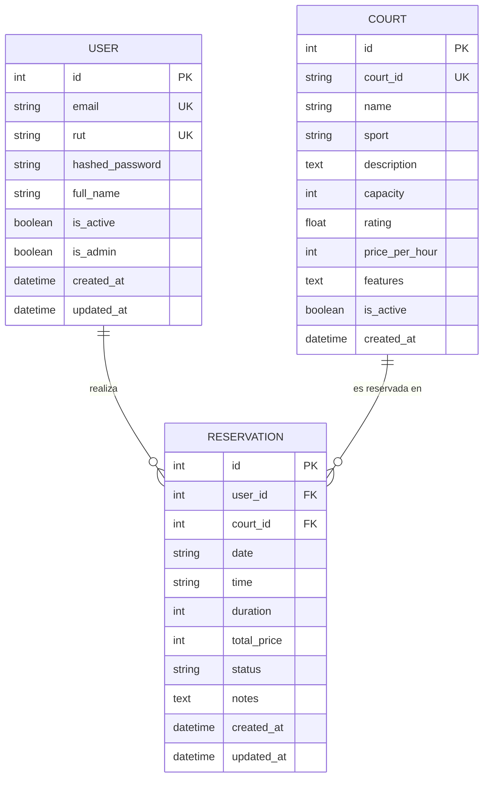
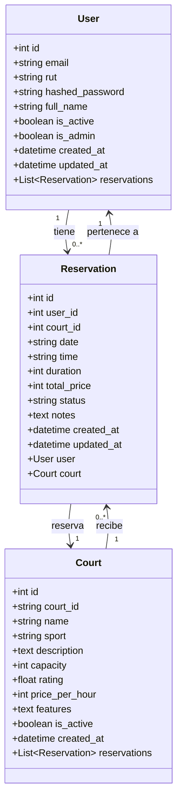

# Modelo de Datos - Sistema de Reservas de Canchas Deportivas

## Diagrama Entidad-Relación

## Diagrama de Clases

## Relaciones

### User → Reservation (1:N)
- Un usuario puede tener múltiples reservas
- Una reserva pertenece a un solo usuario

### Court → Reservation (1:N)
- Una cancha puede tener múltiples reservas
- Una reserva es para una sola cancha

## Tipos de Datos Enumerados

### Sport (Deporte)
- `Fútbol`
- `Tenis`
- `Pádel`

### Status (Estado de Reserva)
- `confirmed`: Confirmada
- `cancelled`: Cancelada
- `completed`: Completada

## Índices y Constraints

### User
- `email`: UNIQUE INDEX
- `rut`: UNIQUE INDEX
- `id`: PRIMARY KEY

### Court
- `court_id`: UNIQUE INDEX
- `id`: PRIMARY KEY

### Reservation
- `user_id`: FOREIGN KEY → users(id)
- `court_id`: FOREIGN KEY → courts(id)
- `id`: PRIMARY KEY

## Validaciones (Pydantic)

### UserCreate
- `rut`: string, normalizado (sin puntos, con guión antes del dígito verificador)
- `password`: min_length=6

### ReservationCreate
- `date`: formato YYYY-MM-DD
- `time`: formato HH:MM
- `duration`: 1-4 horas (ge=1, le=4)
